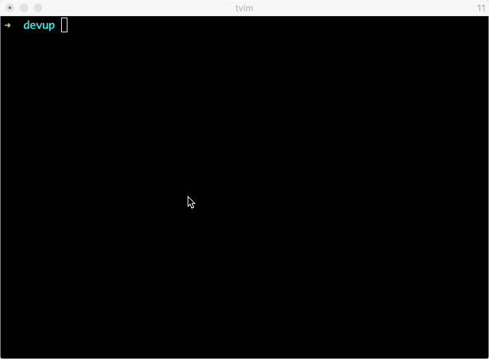

# DevUp!

[](https://travis-ci.com/github/sergio-fry/devup)
[](https://rubygems.org/gems/devup)
[](https://codeclimate.com/github/sergio-fry/devup)
[](https://codeclimate.com/github/sergio-fry/devup)
[](https://rubygems.org/gems/devup)

**DevUp!** is a tool to run dev dependencies. It builds ENV vars with dynamic exposed ports for services defined in a docker-compose.yml to access from application.



## Installation

    $ gem install devup

## Usage


Create a docker-compose.yml with app dependencies like:

```yaml
version: '3'

services:
  postgres:
    image: postgres
    ports:
      - "5432"
```

Add devup/dotenv to your Gemfile:

    gem "devup"

For each service from docker-compose.yml **DevUp!**  will export ENV variable like

    POSTGRES_HOST=0.0.0.0
    POSTGRES_PORT=5432

### Rails


Update your database.yml to use ENV:

```yaml
default: &default
  adapter: postgresql
  encoding: unicode
  host: <%= ENV.fetch("POSTGRES_HOST") %>
  port: <%= ENV.fetch("POSTGRES_PORT") %>
  username: postgres
  password:

development:
  <<: *default
  database: development

test:
  <<: *default
  database: test
```


You are ready to start rails

    $ bundle exec rake db:create db:migrate
    $ bundle exec rails server


### Without Rails


```ruby
require "devup"
require "sequel"

DB = Sequel.connect("postgres://postgres@#{ENV.fetch( "POSTGRES_HOST" )}:#{ENV.fetch("POSTGRES_PORT")}/database_name")
```


### Without Ruby (PHP, nodejs, Java, ...)

Start up services

    $ devup

Load ENV vars from generated .env.services

    $ source .env.services

Now you can run app


## Development

After checking out the repo, run `bin/setup` to install dependencies. Then, run `rake spec` to run the tests. You can also run `bin/console` for an interactive prompt that will allow you to experiment.

To install this gem onto your local machine, run `bundle exec rake install`. To release a new version, update the version number in `version.rb`, and then run `bundle exec rake release`, which will create a git tag for the version, push git commits and tags, and push the `.gem` file to [rubygems.org](https://rubygems.org).

## Contributing

Bug reports and pull requests are welcome on GitHub at https://github.com/sergio-fry/devup. This project is intended to be a safe, welcoming space for collaboration, and contributors are expected to adhere to the [code of conduct](https://github.com/sergio-fry/devup/blob/master/CODE_OF_CONDUCT.md).


## License

The gem is available as open source under the terms of the [MIT License](https://opensource.org/licenses/MIT).

## Code of Conduct

Everyone interacting in the Devup project's codebases, issue trackers, chat rooms and mailing lists is expected to follow the [code of conduct](https://github.com/sergio-fry/devup/blob/master/CODE_OF_CONDUCT.md).
